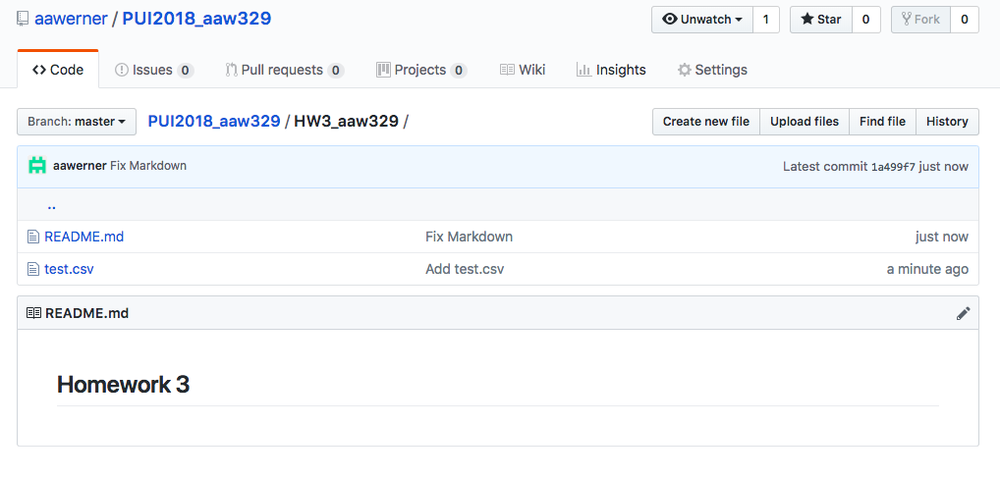
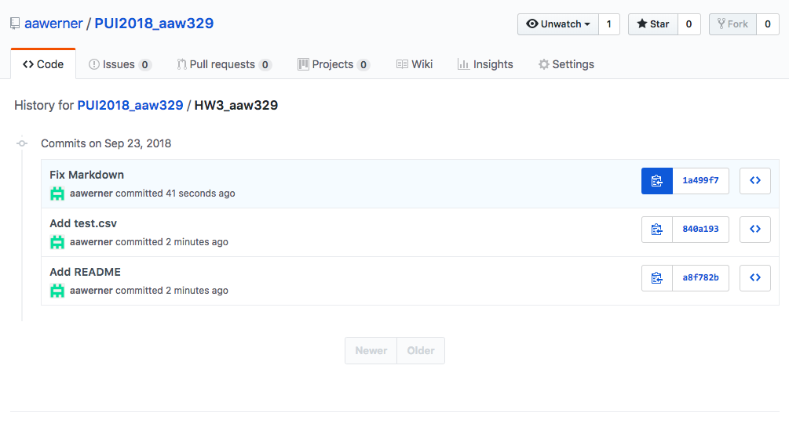
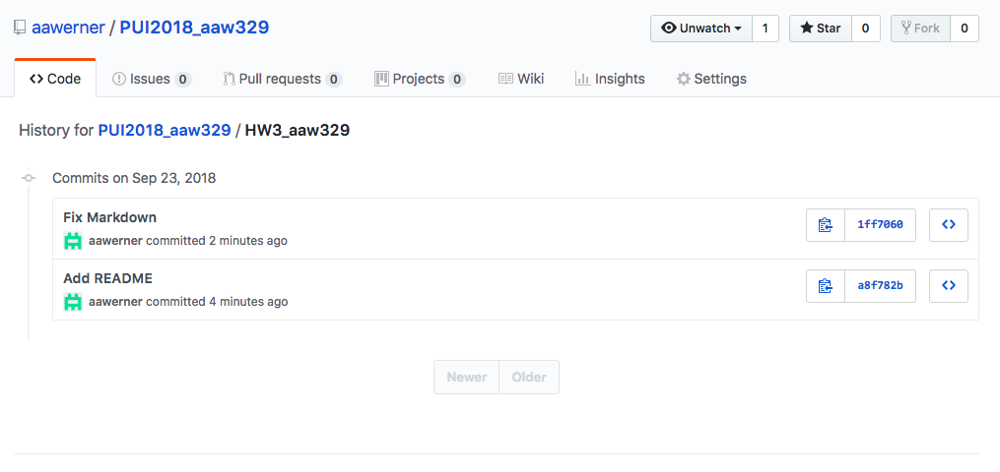

# Homework 3

## Assignment 1

Objective: create a file and then remove its presence from a GitHub repository. This is useful in case some sensitive data ends up on GitHub by accident.

Proof that there was a file named "test.csv":

Proof that the file and all of its associated history was removed:

