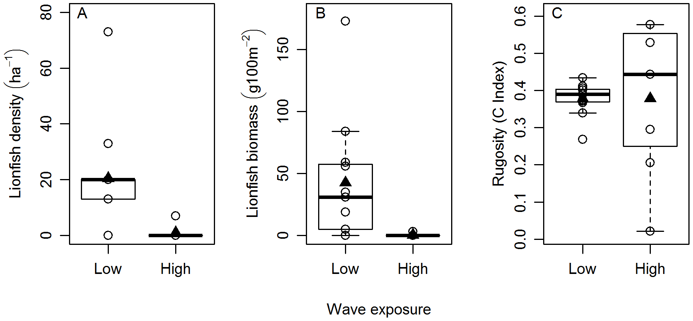
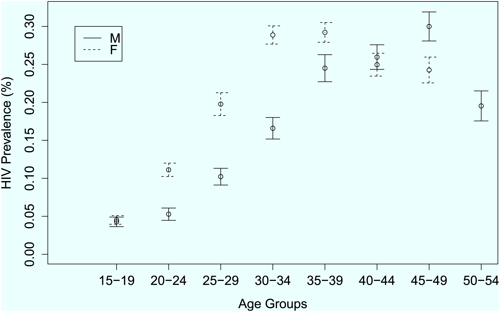

## Assignment 1

Review [another student's Citi Bike project proposal](https://github.com/sunghoonyang/PUI2018_shy256/pull/8 "My pull request for Duke's Citi Bike project proposal"). 

## Assignment 2

Find three research papers that make use of three different types of statistical tests: one that tells us about differences between two groups, one that helps us fine relationships between independent and dependent variables, and finally a linear regression. 

| Statistical analysis | IV | IV type | DV | DV types | CV | CV type | Question | H0 | alpha | Link to paper | 
|:---------------------|:---|:--------|:---|:---------|:---|:--------|:---------|:---|:------|:--------------|
| Student's t-test (paired samples) | Road grade | Continuous | Speed | Continuous | None | None | How do grades affect vehicle speeds? | neighboring_grade_1 == neighboring_grade_2 | 0.05 | [Evaluating the impacts of grades on vehicular speeds on interstate highways](https://journals.plos.org/plosone/article?id=10.1371/journal.pone.0184142) | 
| Correlation | Wave exposure (high/low) | Dichotomous | Lionfish biomass and density | Continuous | None | None | Is lionfish biomass/density correlated with either high or low wave exposure? | lionfish_at_highwave == lionfish_at_lowwave | 0.05 | [Environmental and Biotic Correlates to Lionfish Invasion Success in Bahamian Coral Reefs](https://journals.plos.org/plosone/article?id=10.1371/journal.pone.0106229) |
| Logistic regression | Age group (one of several considered) | Categorical | HIV status | Dichotomous | None | None | What is the probability that an individual will be HIV+ based on their age group? | (n_hiv+ / n_hiv-) > probability(age_group) or (n_hiv+ / n_hiv-) < probability(age_group) | 0.05 | [Estimating HIV Prevalence in Zimbabwe Using Population-Based Survey Data](https://journals.plos.org/plosone/article?id=10.1371/journal.pone.0140896)

The main plots of each article, in order.

## Assignment 3

Calculate z-test and chi-squared statistics to draw conclusions about data in the [New York: Center for Employment Opportunities Study](https://www.mdrc.org/sites/default/files/What%20Strategies%20Work%20for%20the%20Hard%20FR.pdf).

## Assignment 4
